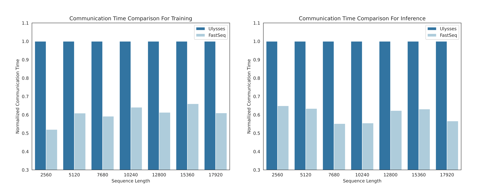

<p align="center">

</p>
<p align="center"><b><big>An Easy, Fast and Memory-Efficient System for DiT Training and Inference</big></b></p>
</p>
<p align="center"><a href="https://github.com/NUS-HPC-AI-Lab/OpenDiT">[Homepage]</a> | <a href="https://discord.gg/6UzVWm9a">[Discord]</a> | <a href="./figure/wechat.png">[WeChat]</a> | <a href="https://twitter.com/YangYou1991/status/1762447718105170185">[Twitter]</a> | <a href="https://zhuanlan.zhihu.com/p/684457582">[Zhihu]</a> | <a href="https://mp.weixin.qq.com/s/IBb9vlo8hfYKrj9ztxkhjg">[Media]</a></p>
</p>

### Latest News 🔥

- [2024/03/01] Support DiT-based Latte for text-to-video generation.
- [2024/02/27] Officially release OpenDiT: An Easy, Fast and Memory-Efficent System for DiT Training and Inference.

# About

OpenDiT is an open-source project that provides a high-performance implementation of Diffusion Transformer (DiT) powered by Colossal-AI, specifically designed to enhance the efficiency of training and inference for DiT applications, including text-to-video generation and text-to-image generation.

OpenDiT boasts the performance by the following techniques:

1. Up to 80% speedup and 50% memory reduction on GPU
   - Kernel optimization including FlashAttention, Fused AdaLN, and Fused layernorm kernel.
   - Hybrid parallelism methods including ZeRO, Gemini, and DDP. Also, sharding the ema model further reduces the memory cost.
2. FastSeq: A novel sequence parallelism method
   - Specially designed for DiT-like workloads where the activation size is large but the parameter size is small.
   - Up to 48% communication save for intra-node sequence parallel.
   - Break the memory limitation of a single GPU and reduce the overall training and inference time.
3. Ease of use
   - Huge performance improvement gains with a few line changes
   - Users do not need to know the implementation of distributed training.
4. Complete pipeline of text-to-image and text-to-video generation
   - Researchers and engineers can easily use and adapt our pipeline to real-world applications without modifying the parallel part.
   - Verify the accuracy of OpenDiT with text-to-image training on ImageNet and release checkpoint.

<p align="center">

</p>

Authors: [Xuanlei Zhao](https://oahzxl.github.io/), [Zhongkai Zhao](https://www.linkedin.com/in/zhongkai-zhao-kk2000/), [Ziming Liu](https://maruyamaaya.github.io/), [Haotian Zhou](https://github.com/ht-zhou), [Qianli Ma](https://fazzie-key.cool/about/index.html), [Yang You](https://www.comp.nus.edu.sg/~youy/)

More features are coming soon!

## Installation

Prerequisites:

- Python >= 3.10
- PyTorch >= 1.13 (We recommend to use a >2.0 version)
- CUDA >= 11.6

We strongly recommend using Anaconda to create a new environment (Python >= 3.10) to run our examples:

```shell
conda create -n opendit python=3.10 -y
conda activate opendit
```

Install ColossalAI:

```shell
git clone https://github.com/hpcaitech/ColossalAI.git
cd ColossalAI
git checkout adae123df3badfb15d044bd416f0cf29f250bc86
pip install -e .
```

Install OpenDiT:

```shell
git clone https://github.com/oahzxl/OpenDiT
cd OpenDiT
pip install -e .
```

(Optional but recommended) Install libraries for training & inference speed up:

```shell
# Install Triton for fused adaln kernel
pip install triton

# Install FlashAttention
pip install flash-attn

# Install apex for fused layernorm kernel
git clone https://github.com/NVIDIA/apex.git
cd apex
git checkout 741bdf50825a97664db08574981962d66436d16a
pip install -v --disable-pip-version-check --no-cache-dir --no-build-isolation --config-settings "--build-option=--cpp_ext" --config-settings "--build-option=--cuda_ext" ./ --global-option="--cuda_ext" --global-option="--cpp_ext"
```

## Usage

### Image

<b>Training.</b> You can train the DiT model on CIFAR10 by executing the following command:

```shell
# Use script
bash train_img.sh
# Use command line
torchrun --standalone --nproc_per_node=2 train.py \
    --model DiT-XL/2 \
    --batch_size 2 \
    --num_classes 10
```

We disable all speedup methods by default. Here are details of some key arguments for training:

- `--nproc_per_node`: The GPU number you want to use for the current node.
- `--plugin`: The booster plugin used by ColossalAI, `zero2` and `ddp` are supported. The default value is `zero2`. Recommend to enable `zero2`.
- `--mixed_precision`: The data type for mixed precision training. The default value is `bf16`.
- `--grad_checkpoint`: Whether enable the gradient checkpointing. This saves the memory cost during training process. The default value is `False`. Recommend to disable it when memory is enough.
- `--enable_layernorm_kernel`: Whether enable the layernorm kernel optimization. This speeds up the training process. The default value is `False`. Recommend to enable it.
- `--enable_flashattn`: Whether enable the FlashAttention. This speeds up the training process. The default value is `False`. Recommend to enable.
- `--enable_modulate_kernel`: Whether enable the modulate kernel optimization. This speeds up the training process. The default value is `False`. This kernel will cause NaN under some circumstances. So we recommend to disable it for now.
- `--sequence_parallel_size`: The sequence parallelism size. Will enable sequence parallelism when setting a value > 1. The default value is 1. Recommend to disable it if memory is enough.
- `--load`: Load previous saved checkpoint dir and continue training.
- `--num_classes`: Label class number. Should be 10 for CIFAR10 and 1000 for ImageNet. Only used for label-to-image generation.

For more details on the configuration of the training process, please visit our code.

<b>Multi-Node Training.</b>

To train OpenDiT on multiple nodes, you can use the following command:

```
colossalai run --nproc_per_node 8 --hostfile hostfile train.py \
    --model DiT-XL/2 \
    --batch_size 2 \
    --num_classes 10
```

And you need to create `hostfile` under the current dir. It should contain all IP address of your nodes and you need to make sure all nodes can be connected without password by ssh. An example of hostfile:

```
111.111.111.111 # ip of node1
222.222.222.222 # ip of node2
```

<b>Inference.</b> You can perform inference using DiT model as follows. You need to replace the checkpoint path to your own trained model. Or you can download [official](https://github.com/facebookresearch/DiT?tab=readme-ov-file#sampling--) or [our](https://drive.google.com/file/d/1P4t2V3RDNcoCiEkbVWAjNetm3KC_4ueI/view?usp=drive_link) checkpoint for inference.

```shell
# Use script
bash sample_img.sh
# Use command line
python sample.py \
    --model DiT-XL/2 \
    --image_size 256 \
    --num_classes 10 \
    --ckpt ckpt_path
```

Here are details of some addtional key arguments for inference:

- `--ckpt`: The weight of ema model `ema.pt`. To check your training progress, it can also be our saved base model `epochXX-global_stepXX/model`, it will produce better results than ema in early training stage.
- `--num_classes`: Label class number. Should be 10 for CIFAR10, and 1000 for ImageNet (including official and our checkpoint).

### Video

<b>Training.</b> We current support `VDiT` and `Latte` for video generation. VDiT adopts DiT structure and use video as inputs data. Latte further use more efficient spatial & temporal blocks based on VDiT (not exactly align with origin [Latte](https://github.com/Vchitect/Latte)).

Our video training pipeline is a faithful implementation, and we encourage you to explore your own strategies using OpenDiT. You can train the video DiT model by executing the following command:

```shell
# train with scipt
bash train_video.sh
# train with command line
# model can also be Latte-XL/1x2x2
torchrun --standalone --nproc_per_node=2 train.py \
    --model VDiT-XL/1x2x2 \
    --use_video \
    --data_path ./videos/demo.csv \
    --batch_size 1 \
    --num_frames 16 \
    --image_size 256 \
    --frame_interval 3

# preprocess
# our code read video from csv using our toy data
# we provide a code to transfer ucf101 to csv format
python preprocess.py
```

This script shares the same speedup methods as we have shown in the image training part. For more details of the configuration of the training process, please visit our code.

<b>Inference.</b> You can perform video inference using DiT model as follows. We are still working on the video ckpt.

```shell
# Use script
bash sample_video.sh
# Use command line
# model can also be Latte-XL/1x2x2
python sample.py \
    --model VDiT-XL/1x2x2 \
    --use_video \
    --ckpt ckpt_path \
    --num_frames 16 \
    --image_size 256 \
    --frame_interval 3
```

Inference tips: 1) EMA model requires quite long time to converge and produce meaningful results. So you can sample base model (`--ckpt /epochXX-global_stepXX/model`) instead of ema model (`--ckpt /epochXX-global_stepXX/ema.pt`) to check your training process. But ema model should be your final result. 2) Modify the text condition in `sample.py` which aligns with your datasets helps to produce better results in the early stage of training.

## FastSeq


In the realm of visual generation models, such as DiT, sequence parallelism is indispensable for effective long-sequence training and low-latency inference. Two key features can summarize the distinctive nature of these tasks:

- The model parameter is smaller compared with LLMs, but the sequence can be very long, making communication a bottleneck.
- As the model size is relatively small, it only needs sequence parallelism within a node.

However, existing methods like DeepSpeed-Ulysses and Megatron-LM Sequence Parallelism face limitations when applied to such tasks. They either introduce excessive sequence communication or lack efficiency in handling small-scale sequence parallelism.

To this end, we present FastSeq, a novel sequence parallelism for large sequences and small-scale parallelism. Our method focuses on minimizing sequence communication by employing only two communication operators for every transformer layer. We leverage AllGather to enhance communication efficiency, and we strategically employ an async ring to overlap AllGather communication with qkv computation, further optimizing performance.

Here are the results of our experiments, more results will be coming soon:



## DiT Reproduction Result

We have trained DiT using the origin method with OpenDiT to verify our accuracy. We have trained the model from scratch on ImageNet for 80k steps on 8xA100. Here are some results generated by our trained DiT:


Our loss also aligns with the results listed in the paper:


To reproduce our results, you need to change the dataset in `train_img.py` and execute the following command:

```
torchrun --standalone --nproc_per_node=8 train.py \
    --model DiT-XL/2 \
    --batch_size 180 \
    --enable_layernorm_kernel \
    --enable_flashattn \
    --mixed_precision bf16 \
    --num_classes 1000
```

## Acknowledgement

We extend our gratitude to [Zangwei Zheng](https://zhengzangw.github.io/) for providing valuable insights into algorithms and aiding in the development of the video pipeline. Additionally, we acknowledge [Shenggan Cheng](https://shenggan.github.io/) for his guidance on code optimization and parallelism. Our appreciation also goes to [Fuzhao Xue](https://xuefuzhao.github.io/), [Shizun Wang](https://littlepure2333.github.io/home/), [Yuchao Gu](https://ycgu.site/), [Shenggui Li](https://franklee.xyz/), and [Haofan Wang](https://haofanwang.github.io/) for their invaluable advice and contributions.

This codebase borrows from [Meta's DiT](https://github.com/facebookresearch/DiT).

## Contributing

If you encounter problems using OpenDiT or have a feature request, feel free to create an issue! We also welcome pull requests from the community.

## Citation

```
@misc{zhao2024opendit,
  author = {Xuanlei Zhao, Zhongkai Zhao, Ziming Liu, Haotian Zhou, Qianli Ma, and Yang You},
  title = {OpenDiT: An Easy, Fast and Memory-Efficient System for DiT Training and Inference},
  year = {2024},
  publisher = {GitHub},
  journal = {GitHub repository},
  howpublished = {\url{https://github.com/NUS-HPC-AI-Lab/OpenDiT}},
}
```

## Star History

[](https://star-history.com/#NUS-HPC-AI-Lab/OpenDiT&Date)
