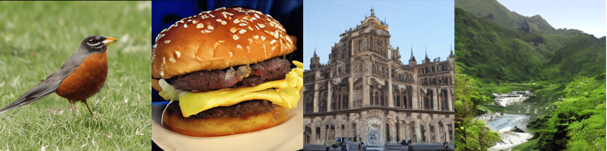

<p align="center">

</p>
<p align="center"><b><big>An easy and efficient system for video generation</big></b></p>
</p>

### Latest News 🔥
- [2024/08] 🔥Release VideoSys: An easy and efficient system for video generation.
- [2024/06] Propose Pyramid Attention Broadcast (PAB)[[blog](https://oahzxl.github.io/PAB/)][[doc](./docs/pab.md)], the first approach to achieve <b>real-time</b> DiT-based video generation, delivering <b>negligible quality loss</b> without <b>requiring any training</b>.
- [2024/06] Support Open-Sora-Plan and Latte.
- [2024/03] Propose Dynamic Sequence Parallel (DSP)[[paper](https://arxiv.org/abs/2403.10266)][[doc](./docs/dsp.md)], achieves **3x** speed for training and **2x** speed for inference in Open-Sora compared with sota sequence parallelism.
- [2024/03] Support Open-Sora: Democratizing Efficient Video Production for All.
- [2024/02] Release OpenDiT: An Easy, Fast and Memory-Efficent System for DiT Training and Inference.

# About

OpenDiT is an open-source project that provides a high-performance implementation of Diffusion Transformer (DiT) powered by Colossal-AI, specifically designed to enhance the efficiency of training and inference for DiT applications, including text-to-video generation and text-to-image generation.

OpenDiT will continue to integrate more open-source DiT models and techniques. Stay tuned for upcoming enhancements and additional features!

## Installation

Prerequisites:

- Python >= 3.10
- PyTorch >= 1.13 (We recommend to use a >2.0 version)
- CUDA >= 11.6

We strongly recommend using Anaconda to create a new environment (Python >= 3.10) to run our examples:

```shell
conda create -n opendit python=3.10 -y
conda activate opendit
```

Install ColossalAI:

```shell
pip install colossalai==0.3.7
```

Install OpenDiT:

```shell
git clone https://github.com/NUS-HPC-AI-Lab/OpenDiT
cd OpenDiT
pip install -e .
```


## Usage

OpenDiT supports many diffusion models with our various acceleration techniques, enabling these models to run faster and consume less memory.

<b>You can find all available models and their supported acceleration techniques in the following table. Click `Doc` to see how to use them.</b>

<table>
    <tr>
        <th rowspan="2">Model</th>
        <th rowspan="2">Train</th>
        <th rowspan="2">Infer</th>
        <th colspan="2">Acceleration Techniques</th>
        <th rowspan="2">Usage</th>
    </tr>
    <tr>
        <th><a href="https://github.com/NUS-HPC-AI-Lab/OpenDiT?tab=readme-ov-file#dyanmic-sequence-parallelism-dsp-paperdoc">DSP</a></th>
        <th><a href="https://github.com/NUS-HPC-AI-Lab/OpenDiT?tab=readme-ov-file#pyramid-attention-broadcast-pab-blogdoc">PAB</a></th>
    </tr>
    <tr>
        <td>Open-Sora [<a href="https://github.com/hpcaitech/Open-Sora">source</a>]</td>
        <td align="center">🟡</td>
        <td align="center">✅</td>
        <td align="center">✅</td>
        <td align="center">✅</td>
        <td align="center"><a href="./docs/opensora.md">Doc</a></td>
    </tr>
    <tr>
        <td>Open-Sora-Plan [<a href="https://github.com/PKU-YuanGroup/Open-Sora-Plan">source</a>]</td>
        <td align="center">❌</td>
        <td align="center">✅</td>
        <td align="center">✅</td>
        <td align="center">✅</td>
        <td align="center"><a href="./docs/opensora_plan.md">Doc</a></td>
    </tr>
    <tr>
        <td>Latte [<a href="https://github.com/Vchitect/Latte">source</a>]</td>
        <td align="center">❌</td>
        <td align="center">✅</td>
        <td align="center">✅</td>
        <td align="center">✅</td>
        <td align="center"><a href="./docs/latte.md">Doc</a></td>
    </tr>
    <tr>
        <td>DiT [<a href="https://github.com/facebookresearch/DiT">source</a>]</td>
        <td align="center">✅</td>
        <td align="center">✅</td>
        <td align="center">❌</td>
        <td align="center">❌</td>
        <td align="center"><a href="./docs/dit.md">Doc</a></td>
    </tr>
</table>

## Acceleration Techniques

### Pyramid Attention Broadcast (PAB) [[blog](https://arxiv.org/abs/2403.10266)][[doc](./docs/pab.md)]

Real-Time Video Generation with Pyramid Attention Broadcast

Authors: [Xuanlei Zhao](https://oahzxl.github.io/)<sup>1*</sup>,  [Xiaolong Jin]()<sup>2*</sup>,  [Kai Wang](https://kaiwang960112.github.io/)<sup>1*</sup>, and [Yang You](https://www.comp.nus.edu.sg/~youy/)<sup>1</sup> (* indicates equal contribution)

<sup>1</sup>National University of Singapore, <sup>2</sup>Purdue University


PAB is the first approach to achieve <b>real-time</b> DiT-based video generation, delivering <b>lossless quality</b> without <b>requiring any training</b>. By mitigating redundant attention computation, PAB achieves up to 21.6 FPS with 10.6x acceleration, without sacrificing quality across popular DiT-based video generation models including [Open-Sora](https://github.com/hpcaitech/Open-Sora), [Latte](https://github.com/Vchitect/Latte) and [Open-Sora-Plan](https://github.com/PKU-YuanGroup/Open-Sora-Plan).

See its details [here](./docs/pab.md).

----

### Dyanmic Sequence Parallelism (DSP) [[paper](https://arxiv.org/abs/2403.10266)][[doc](./docs/dsp.md)]


DSP is a novel, elegant and super efficient sequence parallelism for [Open-Sora](https://github.com/hpcaitech/Open-Sora), [Latte](https://github.com/Vchitect/Latte) and other multi-dimensional transformer architecture.

It achieves **3x** speed for training and **2x** speed for inference in Open-Sora compared with sota sequence parallelism ([DeepSpeed Ulysses](https://arxiv.org/abs/2309.14509)). For a 10s (80 frames) of 512x512 video, the inference latency of Open-Sora is:

| Method | 1xH800 | 8xH800 (DS Ulysses) | 8xH800 (DSP) |
| ------ | ------ | ------ | ------ |
| Latency(s) | 106 | 45 | 22 |

See its details [here](./docs/dsp.md).

----

## DiT Reproduction Result

We have trained DiT using the origin method with OpenDiT to verify our accuracy. We have trained the model from scratch on ImageNet for 80k steps on 8xA100. Here are some results generated by our trained DiT:



Our loss also aligns with the results listed in the paper:


To reproduce our results, you can follow our [instruction](./docs/dit.md/#reproduction
).

## Acknowledgement

Thanks [Xuanlei Zhao](https://oahzxl.github.io/), [Zhongkai Zhao](https://www.linkedin.com/in/zhongkai-zhao-kk2000/), [Ziming Liu](https://maruyamaaya.github.io/), [Haotian Zhou](https://github.com/ht-zhou), [Qianli Ma](https://fazzie-key.cool/about/index.html), [Yang You](https://www.comp.nus.edu.sg/~youy/), [Xiaolong Jin](), [Kai Wang](https://kaiwang960112.github.io/) for their contributions. We also extend our gratitude to [Zangwei Zheng](https://zhengzangw.github.io/), [Shenggan Cheng](https://shenggan.github.io/), [Fuzhao Xue](https://xuefuzhao.github.io/), [Shizun Wang](https://littlepure2333.github.io/home/), [Yuchao Gu](https://ycgu.site/), [Shenggui Li](https://franklee.xyz/), and [Haofan Wang](https://haofanwang.github.io/) for their invaluable advice.

This codebase borrows from:
* [Open-Sora](https://github.com/hpcaitech/Open-Sora): Democratizing Efficient Video Production for All.
* [DiT](https://github.com/facebookresearch/DiT): Scalable Diffusion Models with Transformers.
* [PixArt](https://github.com/PixArt-alpha/PixArt-alpha): An open-source DiT-based text-to-image model.
* [Latte](https://github.com/Vchitect/Latte): An attempt to efficiently train DiT for video.

## Contributing

If you encounter problems using OpenDiT or have a feature request, feel free to create an issue! We also welcome pull requests from the community.

## Citation

```
@misc{zhao2024opendit,
  author = {Xuanlei Zhao, Zhongkai Zhao, Ziming Liu, Haotian Zhou, Qianli Ma, and Yang You},
  title = {OpenDiT: An Easy, Fast and Memory-Efficient System for DiT Training and Inference},
  year = {2024},
  publisher = {GitHub},
  journal = {GitHub repository},
  howpublished = {\url{https://github.com/NUS-HPC-AI-Lab/OpenDiT}},
}

@misc{zhao2024dsp,
      title={DSP: Dynamic Sequence Parallelism for Multi-Dimensional Transformers},
      author={Xuanlei Zhao and Shenggan Cheng and Zangwei Zheng and Zheming Yang and Ziming Liu and Yang You},
      year={2024},
      eprint={2403.10266},
      archivePrefix={arXiv},
      primaryClass={cs.DC}
}
```

## Star History

[](https://star-history.com/#NUS-HPC-AI-Lab/OpenDiT&Date)
