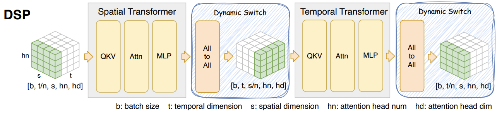

## Install
pip install -e .

## Run
normal:
torchrun --standalone --nproc_per_node=1 scripts/opensora/sample_opensora.py --config configs/opensora/sample.yaml
skip:
torchrun --standalone --nproc_per_node=1 scripts/opensora/sample_opensora.py --config configs/opensora/sample_skip.yaml

## Description
Main code modification is in opendit/modules/attn.py
Control flag is also at the top this file.

## Code format
Recommend to commit code by PR.

Need to install code formater
```shell
# these commands are executed under the Colossal-AI directory
pip install pre-commit
pre-commit install
```


<p align="center">

</p>
<p align="center"><b><big>An Easy, Fast and Memory-Efficient System for DiT Training and Inference</big></b></p>
</p>
<p align="center"><a href="https://github.com/NUS-HPC-AI-Lab/OpenDiT">[Homepage]</a> | <a href="https://discord.gg/E9Dew2vd">[Discord]</a> | <a href="./figure/wechat.png">[WeChat]</a> | <a href="https://twitter.com/YangYou1991/status/1762447718105170185">[Twitter]</a> | <a href="https://zhuanlan.zhihu.com/p/684457582">[Zhihu]</a> | <a href="https://mp.weixin.qq.com/s/IBb9vlo8hfYKrj9ztxkhjg">[Media]</a></p>
</p>

### Latest News 🔥
- [2024/06] Support OpenSora, Open-Sora-Plan and Latte.
- [2024/03] Propose Dynamic Sequence Parallel (DSP)[[paper](https://arxiv.org/abs/2403.10266)][[doc](./docs/dsp.md)], achieves **3x** speed for training and **2x** speed for inference in OpenSora compared with sota sequence parallelism.
- [2024/03] Support [OpenSora](https://github.com/hpcaitech/Open-Sora): Democratizing Efficient Video Production for All.
- [2024/02] Officially release OpenDiT: An Easy, Fast and Memory-Efficent System for DiT Training and Inference.

# About

OpenDiT is an open-source project that provides a high-performance implementation of Diffusion Transformer (DiT) powered by Colossal-AI, specifically designed to enhance the efficiency of training and inference for DiT applications, including text-to-video generation and text-to-image generation.

OpenDiT has been adopted by: [OpenSora](https://github.com/hpcaitech/Open-Sora), [MiniSora](https://github.com/mini-sora/minisora), [SpeeDiT](https://github.com/1zeryu/SpeeDiT).

OpenDiT boasts the performance by the following techniques:

1. Up to 80% speedup and 50% memory reduction on GPU
   - Kernel optimization including FlashAttention, Fused AdaLN, and Fused layernorm kernel.
   - Hybrid parallelism methods including ZeRO, Gemini, and DDP. Also, sharding the ema model further reduces the memory cost.
2. FastSeq: A novel sequence parallelism method
   - Specially designed for DiT-like workloads where the activation size is large but the parameter size is small.
   - Up to 48% communication save for intra-node sequence parallel.
   - Break the memory limitation of a single GPU and reduce the overall training and inference time.
3. Ease of use
   - Huge performance improvement gains with a few line changes
   - Users do not need to know the implementation of distributed training.
4. Complete pipeline of text-to-image and text-to-video generation
   - Researchers and engineers can easily use and adapt our pipeline to real-world applications without modifying the parallel part.
   - Verify the accuracy of OpenDiT with text-to-image training on ImageNet and release checkpoint.

<p align="center">

</p>

Authors: [Xuanlei Zhao](https://oahzxl.github.io/), [Zhongkai Zhao](https://www.linkedin.com/in/zhongkai-zhao-kk2000/), [Ziming Liu](https://maruyamaaya.github.io/), [Haotian Zhou](https://github.com/ht-zhou), [Qianli Ma](https://fazzie-key.cool/about/index.html), [Yang You](https://www.comp.nus.edu.sg/~youy/)

OpenDiT will continue to integrate more open-source DiT models. Stay tuned for upcoming enhancements and additional features!

## Installation

Prerequisites:

- Python >= 3.10
- PyTorch >= 1.13 (We recommend to use a >2.0 version)
- CUDA >= 11.6

We strongly recommend using Anaconda to create a new environment (Python >= 3.10) to run our examples:

```shell
conda create -n opendit python=3.10 -y
conda activate opendit
```

Install ColossalAI:

```shell
pip install colossalai==0.3.7
```

Install OpenDiT:

```shell
git clone https://github.com/oahzxl/OpenDiT
cd OpenDiT
pip install -e .
```

(Optional but recommended) Install libraries for training & inference speed up (you can run our code without these libraries):

```shell
# Install FlashAttention
pip install flash-attn
```

## Usage

OpenDiT fully supports the following models, including training and inference, which align with the original methods. Through our novel techniques, we enable these models to run faster and consume less memory. Here's how you can use them:

| Model | Train | Inference | Optimize | Usage |
| ------ | :------: | :------: | :------: | :------: |
| [DiT](https://github.com/facebookresearch/DiT)| ✅ | ✅ | ✅ | [Doc](./docs/dit.md)
| [OpenSora](https://github.com/hpcaitech/Open-Sora)| ✅ | ✅ | ✅ | [Doc](./docs/opensora.md)
| [Latte](https://github.com/Vchitect/Latte)| ❌ | ✅ | ❌ | [Doc](./docs/latte.md)
| [Open-Sora-Plan](https://github.com/PKU-YuanGroup/Open-Sora-Plan)| ❌ | ✅ | ❌ | [Doc](./docs/opensora_plan.md)

## Technique Overview

### DSP [[paper](https://arxiv.org/abs/2403.10266)][[doc](./docs/dsp.md)]




DSP (Dynamic Sequence Parallelism) is a novel, elegant and super efficient sequence parallelism for [OpenSora](https://github.com/hpcaitech/Open-Sora), [Latte](https://github.com/Vchitect/Latte) and other multi-dimensional transformer architecture.

It achieves **3x** speed for training and **2x** speed for inference in OpenSora compared with sota sequence parallelism ([DeepSpeed Ulysses](https://arxiv.org/abs/2309.14509)). For a 10s (80 frames) of 512x512 video, the inference latency of OpenSora is:

| Method | 1xH800 | 8xH800 (DS Ulysses) | 8xH800 (DSP) |
| ------ | ------ | ------ | ------ |
| Latency(s) | 106 | 45 | 22 |

See its detail and usage [here](./docs/dsp.md).

----

### FastSeq [[doc](./docs/fastseq.md)]


FastSeq is a novel sequence parallelism for large sequences and small-scale parallelism.

It focuses on minimizing sequence communication by employing only two communication operators for every transformer layer, and we an async ring to overlap AllGather communication with qkv computation. See its detail and usage [here](./docs/fastseq.md).

### PAB[[doc](./docs/pab.md)]

[image]

PAB is a novel training-free algorithm that significantly accelerates DiT-based video generation.

PAB achieves up to 21.6 FPS with 10.6x acceleration, without sacrificing quality across popular DiT-based video generation models including [Open-Sora](https://github.com/hpcaitech/Open-Sora), [Open-Sora-Plan](https://github.com/PKU-YuanGroup/Open-Sora-Plan), and [Latte](https://github.com/Vchitect/Latte), by leveraging Pyramid Attention Broadcast(PAB) to mitigate redundant attention computation. See its detail and usage [here](./docs/pab.md).

For a xxs(xx frames) of 512x512 video, the inference latency of OpenSora is:

| Method | 1xH800 | 8xH800 | 8xH800 |
| ------ | ------ | ------ | ------ |
| Latency(s) | |  |  |


## DiT Reproduction Result

We have trained DiT using the origin method with OpenDiT to verify our accuracy. We have trained the model from scratch on ImageNet for 80k steps on 8xA100. Here are some results generated by our trained DiT:


Our loss also aligns with the results listed in the paper:


To reproduce our results, you can follow our [instruction](./docs/dit.md/#reproduction
).

## Acknowledgement

We extend our gratitude to [Zangwei Zheng](https://zhengzangw.github.io/) for providing valuable insights into algorithms and aiding in the development of the video pipeline. Additionally, we acknowledge [Shenggan Cheng](https://shenggan.github.io/) for his guidance on code optimization and parallelism. Our appreciation also goes to [Fuzhao Xue](https://xuefuzhao.github.io/), [Shizun Wang](https://littlepure2333.github.io/home/), [Yuchao Gu](https://ycgu.site/), [Shenggui Li](https://franklee.xyz/), and [Haofan Wang](https://haofanwang.github.io/) for their invaluable advice and contributions.

This codebase borrows from:
* [OpenSora](https://github.com/hpcaitech/Open-Sora): Democratizing Efficient Video Production for All.
* [DiT](https://github.com/facebookresearch/DiT): Scalable Diffusion Models with Transformers.
* [PixArt](https://github.com/PixArt-alpha/PixArt-alpha): An open-source DiT-based text-to-image model.
* [Latte](https://github.com/Vchitect/Latte): An attempt to efficiently train DiT for video.

## Contributing

If you encounter problems using OpenDiT or have a feature request, feel free to create an issue! We also welcome pull requests from the community.

## Citation

```
@misc{zhao2024opendit,
  author = {Xuanlei Zhao, Zhongkai Zhao, Ziming Liu, Haotian Zhou, Qianli Ma, and Yang You},
  title = {OpenDiT: An Easy, Fast and Memory-Efficient System for DiT Training and Inference},
  year = {2024},
  publisher = {GitHub},
  journal = {GitHub repository},
  howpublished = {\url{https://github.com/NUS-HPC-AI-Lab/OpenDiT}},
}
@misc{zhao2024dsp,
      title={DSP: Dynamic Sequence Parallelism for Multi-Dimensional Transformers},
      author={Xuanlei Zhao and Shenggan Cheng and Zangwei Zheng and Zheming Yang and Ziming Liu and Yang You},
      year={2024},
      eprint={2403.10266},
      archivePrefix={arXiv},
      primaryClass={cs.DC}
}
```

## Star History

[](https://star-history.com/#NUS-HPC-AI-Lab/OpenDiT&Date)
