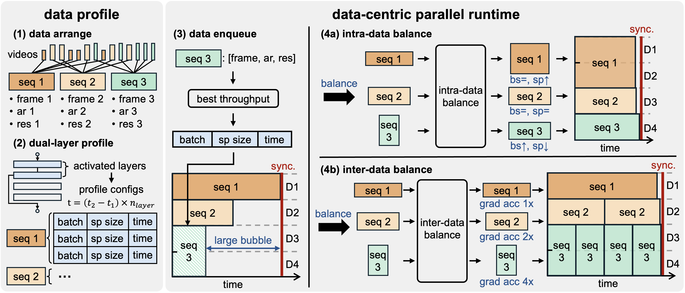
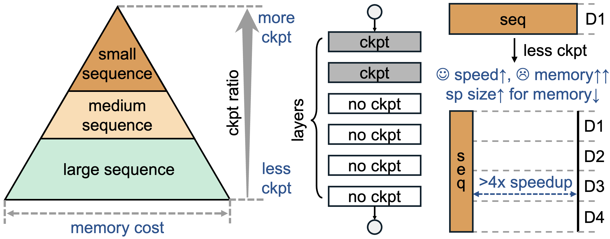

# Data-Centric Parallel (DCP)

[[blog](https://oahzxl.github.io/DCP/)]

- [Data-Centric Parallel (DCP)](#data-centric-parallel-dcp)
  - [Motivation](#motivation)
  - [Data-Centric Parallel (DCP) Mechanism](#data-centric-parallel-dcp-mechanism)
  - [Pyramid Activation Checkpointing](#pyramid-activation-checkpointing)
  - [Experimental Results](#experimental-results)
  - [Usage](#usage)
    - [Supported Models](#supported-models)
    - [Configuration for DCP](#configuration-for-dcp)
      - [Parameters](#parameters)
      - [Example Configuration](#example-configuration)


We introduce Data-Centric Parallel (DCP), a simple but effective approach to accelerate distributed training of varaible sequences (e.g., videos). Unlike previous methods that fix training settings, DCP dyanmically adjusts parallelism and other configs driven by incoming data during runtime. This method significantly reduces communication overhead and computational inefficiencies, achieving up to 2.1x speedup. As a ease-of-use method, our method can enpower any models and most parallel methods within minimal code changes (10 lines).

Quick start:
```bash
# run benchmark
bash examples/training/open_sora/benchmark.sh
```

## Motivation


Variable sequences training is commonly used in various tasks, such as video generation (Sora, Movie Gen, Open-Sora, HunyuanVideo), text generation (Llama-3), and scientific computing (AlphaFold). Such strategy offers them two advantages: enhanced generation quality and flexible output sizes.

We compare two common parallel methods for variable sequences training in the above figure. Bucket parallel fixes sequence parallel size based on the longest sequence, adjusting batch sizes for balance. Packed parallel, while also fixing sequence parallel size, concats multiple sequences in one batch.

However, bucket parallel struggles with workload imbalance at small batch sizes and communication inefficiency for shorter sequences, while packed parallel, despite better load balancing, incurs unnecessary communication overhead and requires complex implementation changes. Both approaches fail to addresses two critical challenges in variable sequences training: necessary sequence parallel for long sequences and the unbalanced workloads from diverse sequence sizes, due to their fixed settings and lack of data awareness.

## Data-Centric Parallel (DCP) Mechanism



To address these challenges, we propose Data-Centric Parallel, an innovative approach that transforms parallel training with data awareness. Instead of fixing all configs during training, our method adaptively change parallel and other settings driven by the incoming data, significantly improving computational efficiency and reducing communication overhead.

As shown in the above figure, our method consists of two main stages: data profile and data-centric runtime. In data profile stage, we classify sequences by size and determine optimal settings for each sequence through fast dual-layer profile. At runtime, we first enqueue sequences into the batch until it's full, and then dynamically balance each sequences using two strategies:

DCP-intra: adjusts the intrinsic settings (e.g., batch size, sequence parallel size) of the sequence.
DCP-inter: optimizes among multiple sequences (e.g., gradient accumulation) without changing intrinsic settings.

## Pyramid Activation Checkpointing



As illustrated in the figure above, sequence sizes are highly varied in variable sequences training, with short sequences using less memory and long sequences using more. Selective activation checkpointing are limited by longer sequences, as they require multi-gpu or even intra-node sequence parallelism if reducing recomputing.

Based on DCP, we propose Pyramid Activation Checkpointing (PAC), which adaptively applies different ckpt ratios based on sequence sizes. This approach significantly improves throughput for the shorter sequences by less recomputing, while maintaining communication overhead for longer sequences, which is even more beneficial in datasets where shorter sequences dominate.

## Experimental Results
Here are the results of our experiments, more results are shown in https://oahzxl.github.io/DCP/:


## Usage

DCP consists of two main stages: data profile and data-centric runtime.
With the same configuration parameters, VideoSys will automatically run the profiling stage or detect the previous profiling results and start the training with the data-centric runtime.

### Supported Models

DCP currently supports Open-Sora.

### Configuration for DCP

To enable the Data-centric Parallel (DCP), configure the following parameters to use different variants of DCP.

#### Parameters
- **dynamic_sp**: Enable or disable variable sequence parallelism for all DCP variants.
  - Type: `True` or `False`

- **dynamic_recompute**: Enable or disable pyramid activation checkpointing (PAC), exclusive to DCP-inter to better exploit GPU memory for shorter sequences.
  - Type: `True` or `False`

- **auto_grad_accumulation**: Enable or disable variable number of gradient accumulation steps for DCP-inter.
  - Type: `True` or `False`

- **max_grad_accumulation_steps**: The maximum number of gradient accumulation steps for DCP-inter.
  - Type: Integer

- **min_grad_accumulation_steps**: The minimum number of gradient accumulation steps for DCP-inter.
  - Type: Integer

- **calculate_imbalance**: Enable or disable logging estimated imbalance rate.
  - Type: `True` or `False`

#### Example Configuration

```yaml
# DCP-intra
dynamic_sp: true

# DCP-inter
dynamic_sp: true
auto_grad_accumulation: true

# DCP-inter+PAC
dynamic_sp: true
dynamic_recompute: true
auto_grad_accumulation: true
```

Explanation:

- **DCP-intra**:
  - Only set variable sequence parllelism to enable DCP-intra (`dynamic_sp: true`)

- **DCP-inter**:
  - Set variable sequence parllelism (`dynamic_sp: true`)
  - Set variable number of gradient accumulation steps to enable DCP-inter (`auto_grad_accumulation: true`)

- **DCP-inter**:
  - Set variable sequence parllelism (`dynamic_sp: true`)
  - Set variable number of gradient accumulation steps (`auto_grad_accumulation: true`)
  - Enable PAC over DCP-inter setup (`auto_grad_accumulation: true`)

Adjust these settings based on your specific needs to optimize the performance.

For complete benchmark examples, please refer to [benchmark.sh](../examples/training/open_sora/benchmark.sh)

#### Customization for new models
The above example is for Open-Sora.
To customize DCP training with your own model, there are a few lines of code to adapt.

1. import and create profiler

```python
from videosys.core.dcp.profiler import Profiler, set_profiler

profiler: Profiler = set_profiler(
        total_layers=model.config.depth,
        bucket_config=args.bucket_config,
        text_max_seq_len=model.config.model_max_length,
        text_hidden_size=model.config.caption_channels,
        global_interpolation=not args.no_global_interpolation,
        dynamic_sp=args.dynamic_sp,
        dynamic_recompute=args.dynamic_recompute,
        auto_grad_acc=args.auto_grad_accumulation,
        do_profile=do_profile,
        distributed_profile=args.distributed_profile,
        node_rank=node_rank,
        node_size=node_size,
        alloc_fraction=args.alloc_memory_fraction,
        profile_path=args.profile_path,
        parallel_mgr=parallel_mgr,
        verbose=args.verbose,
    )
```

2. hack the training loop
```python
    for epoch in range(epochs):
        # insert 4 lines:
        # - build a fake dataloader and
        # - initialize the profiler to run data profiling
        if profiler.need_profile():
            profiler.init_profiler()
            num_steps_per_epoch = None
            dataloader_iter = profiler.get_data_iter()
        else:
            sampler.set_epoch(epoch)
            num_steps_per_epoch = len(dataloader)
            dataloader_iter = iter(dataloader)

        for step, batch in enumerate(dataloader_iter):
          # Insert 2 lines to enable DCP
          # - change sequence parallel size
          # - change gradient accumulation steps
          # - change recomputation
          profiler.optimize_dynamics(batch, model)
          with profiler.profile(batch, model, gas):
            batch = batch.cuda()
            loss = model(batch)
            model.backward(loss)
            model.step()
```
