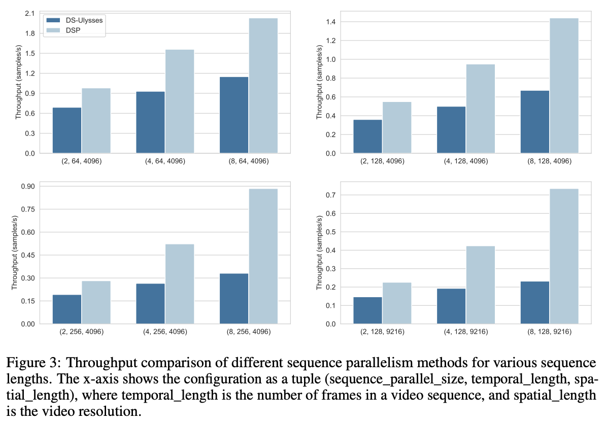

# DSP

paper: https://arxiv.org/abs/2403.10266

DSP (Dynamic Sequence Parallelism) is a novel, elegant and super efficient sequence parallelism for [OpenSora](https://github.com/hpcaitech/Open-Sora), [Latte](https://github.com/Vchitect/Latte) and other multi-dimensional transformer architecture.

The key idea is to dynamically switch the parallelism dimension according to the current computation stage, leveraging the potential characteristics of multi-dimensional transformers. Compared with splitting head and sequence dimension as previous methods, it can reduce at least 75% of communication cost.

It achieves **3x** speed for training and **2x** speed for inference in OpenSora compared with sota sequence parallelism ([DeepSpeed Ulysses](https://arxiv.org/abs/2309.14509)). For a 10s (80 frames) of 512x512 video, the inference latency of OpenSora is:

| Method | 1xH800 | 8xH800 (DS Ulysses) | 8xH800 (DSP) |
| ------ | ------ | ------ | ------ |
| Latency(s) | 106 | 45 | 22 |

The following is DSP's end-to-end throughput for training of OpenSora:

### Usage

DSP is currently supported for: OpenSora, OpenSoraPlan and Latte. To enable DSP, you just need to launch with multiple GPUs.
