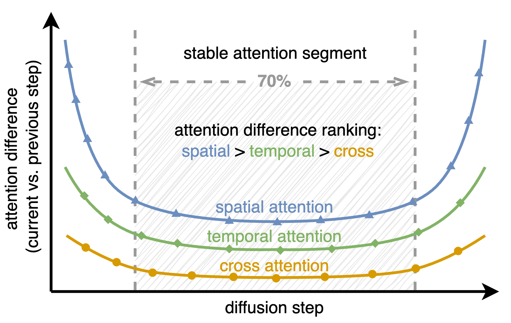
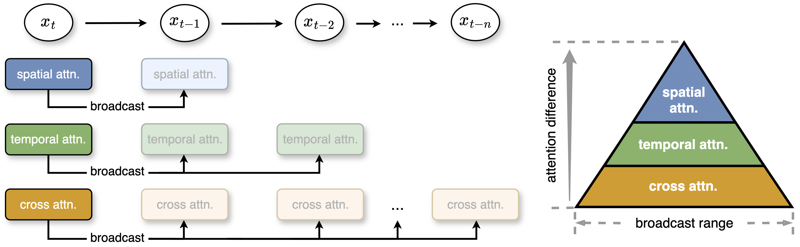
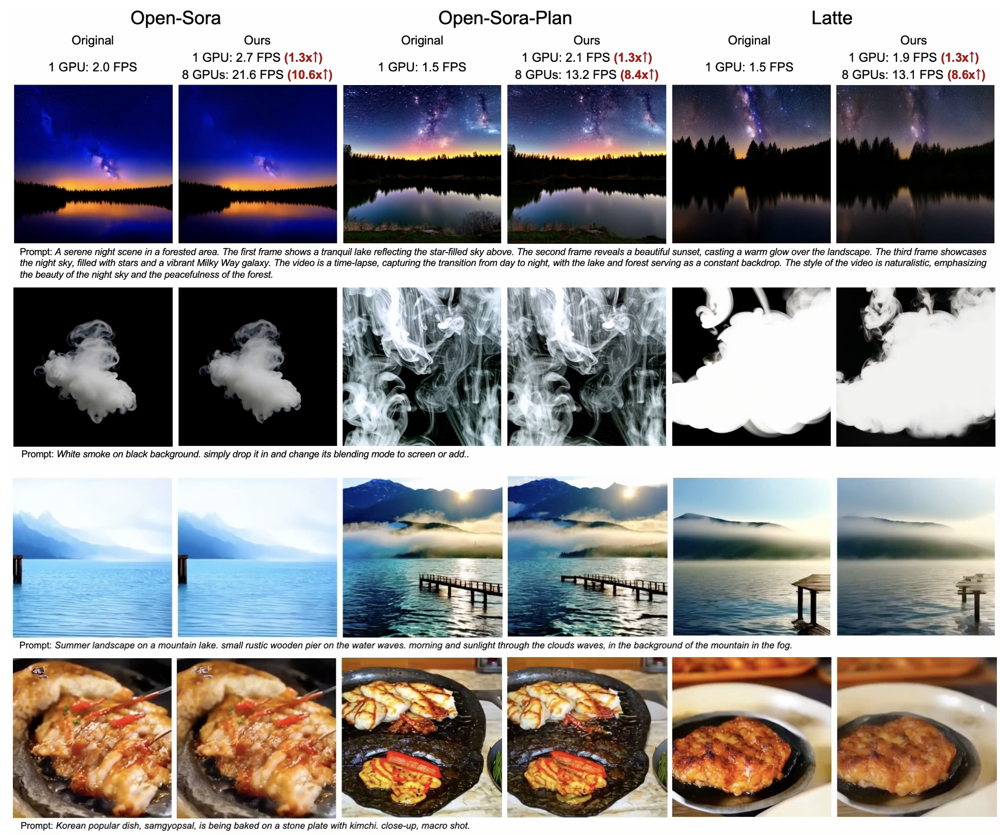

# Pyramid Attention Broadcast(PAB)

[[paper](https://arxiv.org/abs/2408.12588)][[blog](https://arxiv.org/abs/2403.10266)]

Pyramid Attention Broadcast(PAB)(#pyramid-attention-broadcastpab)
- [Pyramid Attention Broadcast(PAB)](#pyramid-attention-broadcastpab)
  - [Insights](#insights)
  - [Pyramid Attention Broadcast (PAB) Mechanism](#pyramid-attention-broadcast-pab-mechanism)
  - [Experimental Results](#experimental-results)
  - [Usage](#usage)
    - [Supported Models](#supported-models)
    - [Configuration for PAB](#configuration-for-pab)
      - [Parameters](#parameters)
      - [Example Configuration](#example-configuration)


We introduce Pyramid Attention Broadcast (PAB), the first approach that achieves real-time DiT-based video generation. By mitigating redundant attention computation, PAB achieves up to 21.6 FPS with 10.6x acceleration, without sacrificing quality across popular DiT-based video generation models including Open-Sora, Open-Sora-Plan, and Latte. Notably, as a training-free approach, PAB can enpower any future DiT-based video generation models with real-time capabilities.

## Insights



Our study reveals two key insights of three **attention mechanisms** within video diffusion transformers:
- First, attention differences across time steps exhibit a U-shaped pattern, with significant variations occurring during the first and last 15% of steps, while the middle 70% of steps show very stable, minor differences.
- Second, within the stable middle segment, the variability differs among attention types:
    - **Spatial attention** varies the most, involving high-frequency elements like edges and textures;
    - **Temporal attention** exhibits mid-frequency variations related to movements and dynamics in videos;
    - **Cross-modal attention** is the most stable, linking text with video content, analogous to low-frequency signals reflecting textual semantics.

## Pyramid Attention Broadcast (PAB) Mechanism



Building on these insights, we propose a **pyramid attention broadcast(PAB)** mechanism to minimize unnecessary computations and optimize the utility of each attention module, as shown in Figure[xx figure] below.

In the middle segment, we broadcast one step's attention outputs to its subsequent several steps, thereby significantly reducing the computational cost on attention modules.

For more efficient broadcast and minimum influence to effect, we set varied broadcast ranges for different attentions based on their stability and differences.
**The smaller the variation in attention, the broader the potential broadcast range.**


## Experimental Results
Here are the results of our experiments, more results are shown in https://oahzxl.github.io/PAB:




## Usage

### Supported Models

PAB currently supports Open-Sora, Open-Sora-Plan, and Latte.

### Configuration for PAB

To efficiently use the Pyramid Attention Broadcast (PAB) mechanism, configure the following parameters to control the broadcasting for different attention types. This helps reduce computational costs by skipping certain steps based on attention stability.

#### Parameters

- **spatial_broadcast**: Enable or disable broadcasting for spatial attention.
  - Type: `True` or `False`

- **spatial_threshold**: Set the range of diffusion steps within which spatial attention is applied.
  - Format: `[min_value, max_value]`

- **spatial_range**: Number of blocks in model to skip during broadcasting for spatial attention.
  - Type: Integer

- **temporal_broadcast**: Enable or disable broadcasting for temporal attention.
  - Type: `True` or `False`

- **temporal_threshold**: Set the range of diffusion steps within which temporal attention is applied.
  - Format: `[min_value, max_value]`

- **temporal_range**: Number of steps to skip during broadcasting for temporal attention.
  - Type: Integer

- **cross_broadcast**: Enable or disable broadcasting for cross-modal attention.
  - Type: `True` or `False`

- **cross_threshold**: Set the range of diffusion steps within which cross-modal attention is applied.
  - Format: `[min_value, max_value]`

- **cross_range**: Number of steps to skip during broadcasting for cross-modal attention.
  - Type: Integer

#### Example Configuration

```yaml
spatial_broadcast: True
spatial_threshold: [100, 800]
spatial_range: 2

temporal_broadcast: True
temporal_threshold: [100, 800]
temporal_range: 3

cross_broadcast: True
cross_threshold: [100, 900]
cross_range: 5
```

Explanation:

- **Spatial Attention**:
  - Broadcasting enabled (`spatial_broadcast: True`)
  - Applied within the threshold range of 100 to 800
  - Skips every 2 steps (`spatial_range: 2`)
  - Active within the first 28 steps (`spatial_block: [0, 28]`)

- **Temporal Attention**:
  - Broadcasting enabled (`temporal_broadcast: True`)
  - Applied within the threshold range of 100 to 800
  - Skips every 3 steps (`temporal_range: 3`)

- **Cross-Modal Attention**:
  - Broadcasting enabled (`cross_broadcast: True`)
  - Applied within the threshold range of 100 to 900
  - Skips every 5 steps (`cross_range: 5`)

Adjust these settings based on your specific needs to optimize the performance of each attention mechanism.
